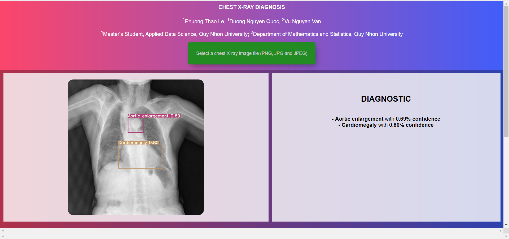

# Chest-X-Ray-Diagnosis: VinBigData Chest X-ray Abnormalities Detection

## Overview
In this study, we compare the performance of two models Faster R-CNN R50 FPN 3x (Detectron2) and YOLOv5 model based on VinBigData Chest X-ray Abnormalities Detection datasets. The results show that the YOLOv5 model has superior performance compared to Faster R-CNN. Therefore, we build a simulation using the YOLOv5 model to detect abnormalities on chest X-ray images.

## Model Building
The process of building 2 models is done in detail in 2 files A and B in folder C .


## Installation
```!pip install -r requirements.txt```

## Training model

### Pre-Trained Model
We can download the weight file of the pre-trained Faster R-CNN and YOLOv5 models at [here](https://drive.google.com/drive/u/2/folders/1QdM5d4I33AhSAIkcMASns4DEIgHTHJjS). Then move the **best.pt** file to the **models** folder.

### OR Train Model
We can train the YOLOv5 model by re-training the **Train_YOLOv5_ColabPro.ipynb** file in the **Train_Model** folder to get the **best.pt** weight file. We use google colab pro with high-RAM runtime and GPU select mode (VGA NVIDIA Tesla P100 16GB). The process of training the model took 3 hours 20 minutes.

## Run Demo
 ```python .\app.py```
 
### Result

 
 
 
 ***Updating ...***
